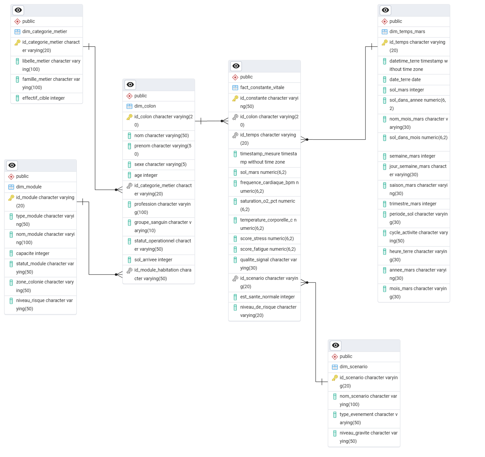

Markdown
# Data Architecture, Quality Audit & Transformation Catalog

This document provides a comprehensive technical breakdown of the datasets used in the **Move to Mars** BI pipeline, including their raw generated state, LLM data quality audit results, and the exact cleansing and enrichment logic executed in **Talend Open Studio** and **Power BI**.

---

## 1. Data Architecture & Relational Model (PostgreSQL)

Below is the entity-relationship diagram (ERD) of the staged and cleaned data warehouse schema in PostgreSQL:



> 💡 **Note:** Primary keys (`id_*`) enforce entity integrity across all dimension and fact tables, while foreign key relationships connect colonist vitals, scenarios, and module assignments into a unified star schema.

---

## 2. Raw Data State & Generation Audit

All datasets were generated dynamically via an autonomous local LLM (`qwen2.5:3b` via **Ollama**) and a custom Python streaming engine. Real-world anomalies were intentionally injected to evaluate downstream ETL resilience.

Below are the exact metrics and schema dimensions audited in `notebooks/data_quality_check.ipynb` prior to ETL processing:

### `CONSTANTE_VITALE.csv`
* **Description:** High-frequency biometric IoT sensor stream.
* **Dimensions:** 216,031 Rows | 12 Columns
* **Strict Duplicates:** 0 (0.00%)
* **Missing / Null Values:**
  * `timestamp_mesure`: 88 NULLs (0.04%)
  * `score_stress`: 418 NULLs (0.19%)
  * `score_fatigue`: 302 NULLs (0.14%)
  * `qualite_signal`: 251 NULLs (0.12%)

| Column Name | Raw Type | Non-Null | Unique Values | Sample Value |
| :--- | :--- | :--- | :--- | :--- |
| `id_constante` | `str` | 216,031 | 216,031 | `CV-000000001` |
| `id_colon` | `str` | 216,031 | 484 | `COL-0113` |
| `id_temps` | `str` | 216,031 | 8,800 | `T-006383` |
| `timestamp_mesure` | `str` | 215,943 | 11,414 | `2075-03-08 11:30:00` |
| `sol_mars` | `int64` | 216,031 | 93 | `67` |
| `frequence_cardiaque_bpm`| `int64` | 216,031 | 47 | `86` |
| `saturation_o2_pct` | `float64` | 216,031 | 84 | `97.9` |
| `temperature_corporelle_c`| `float64` | 216,031 | 21 | `36.6` |
| `score_stress` | `str` | 215,613 | 2,343 | `59.1` |
| `score_fatigue` | `str` | 215,729 | 2,076 | `18.7` |
| `qualite_signal` | `str` | 215,780 | 3 | `OK` |
| `id_scenario` | `str` | 216,031 | 4 | `SCEN-001` |

---

### `COLON.csv`
* **Description:** Population demographic and assignment records.
* **Dimensions:** 255 Rows | 11 Columns
* **Strict Duplicates:** 4 Rows (1.57%)
* **Missing / Null Values:** `age`: 1 NULL (0.39%)

| Column Name | Raw Type | Non-Null | Unique Values | Sample Value |
| :--- | :--- | :--- | :--- | :--- |
| `id_colon` | `str` | 255 | 250 | `COL-0001` |
| `nom` | `str` | 255 | 20 | `Benali` |
| `prenom` | `str` | 255 | 33 | `Hugo` |
| `sexe` | `str` | 255 | 2 | `H` |
| `age` | `float64` | 254 | 45 | `42.0` |
| `id_categorie_metier` | `str` | 255 | 13 | `CAT-03` |
| `profession` | `str` | 255 | 13 | `Biologiste` |
| `groupe_sanguin` | `str` | 255 | 8 | `AB+` |
| `statut_operationnel` | `str` | 255 | 4 | `ACTIF` |
| `sol_arrivee` | `int64` | 255 | 74 | `4` |
| `id_module_habitation`| `str` | 255 | 19 | `MOD-HAB-007` |

---

### `DIM_TEMPS_MARS.csv`
* **Description:** Martian time dimension table mapping Sols to Earth calendar timestamps.
* **Dimensions:** 64,224 Rows | 13 Columns
* **Strict Duplicates:** 0 (0.00%)
* **Missing / Null Values:** `sol_dans_annee`: 59 NULLs (0.09%), `sol_dans_mois`: 61 NULLs (0.09%)

| Column Name | Raw Type | Non-Null | Unique Values | Sample Value |
| :--- | :--- | :--- | :--- | :--- |
| `id_temps` | `str` | 64,224 | 64,224 | `T-000001` |
| `datetime_terre` | `str` | 64,224 | 64,224 | `2075-01-01 00:00:00` |
| `date_terre` | `str` | 64,224 | 841 | `2075-01-01` |
| `sol_mars` | `int64` | 64,224 | 669 | `1` |
| `sol_dans_annee` | `float64` | 64,165 | 669 | `1.0` |
| `nom_mois_mars` | `str` | 64,224 | 24 | `Mois 01` |
| `sol_dans_mois` | `float64` | 64,163 | 30 | `1.0` |
| `semaine_mars` | `int64` | 64,224 | 96 | `1` |
| `jour_semaine_mars` | `str` | 64,224 | 7 | `Sol 1` |
| `saison_mars` | `str` | 64,224 | 4 | `Printemps` |
| `trimestre_mars` | `int64` | 64,224 | 4 | `1` |
| `periode_sol` | `str` | 64,224 | 4 | `Nuit` |
| `cycle_activite` | `str` | 64,224 | 3 | `Repos` |

---

### `MODULE.csv`
* **Dimensions:** 39 Rows | 7 Columns
* **Missing / Null Values:** None (100% complete)

| Column Name | Raw Type | Non-Null | Unique Values | Sample Value |
| :--- | :--- | :--- | :--- | :--- |
| `id_module` | `str` | 39 | 39 | `MOD-HAB-001` |
| `type_module` | `str` | 39 | 9 | `Habitat` |
| `nom_module` | `str` | 39 | 39 | `Habitat 1` |
| `capacite` | `int64` | 39 | 23 | `28` |
| `statut_module` | `str` | 39 | 7 | `OPERATIONNEL` |
| `zone_colonie` | `str` | 39 | 6 | `Est` |
| `niveau_risque` | `str` | 39 | 9 | `FAIBLE` |

---

### `CATEGORIE_METIER.csv`
* **Dimensions:** 13 Rows | 4 Columns
* **Missing / Null Values:** None (100% complete)

| Column Name | Raw Type | Non-Null | Unique Values | Sample Value |
| :--- | :--- | :--- | :--- | :--- |
| `id_categorie_metier` | `str` | 13 | 13 | `CAT-01` |
| `libelle_metier` | `str` | 13 | 13 | `Médecin` |
| `famille_metier` | `str` | 13 | 9 | `Santé` |
| `effectif_cible` | `int64` | 13 | 9 | `5` |

---

### `SCENARIO.csv`
* **Dimensions:** 4 Rows | 4 Columns
* **Missing / Null Values:** None (100% complete)

| Column Name | Raw Type | Non-Null | Unique Values | Sample Value |
| :--- | :--- | :--- | :--- | :--- |
| `id_scenario` | `str` | 4 | 4 | `SCEN-001` |
| `nom_scenario` | `str` | 4 | 4 | `Nominal / Routine` |
| `type_evenement` | `str` | 4 | 3 | `Opérationnel` |
| `niveau_gravite` | `str` | 4 | 4 | `FAIBLE` |

---

## 2. Talend ETL Cleansing & Corrective Actions

In **Talend Open Studio**, specific transformation jobs and custom Java routines were implemented to sanitize raw data before staging it into the PostgreSQL Data Warehouse:

### `CATEGORIE_METIER`
* **Whitespace Trimming:** Applied `.trim()` to remove extra leading and trailing padding from text columns.

### `MODULE`
* **Status Normalization (`statut_module`):** Standardized status values (e.g., mapped `"op"` to `"OPERATIONNEL"`).
* **Risk Level Normalization (`niveau_risque`):** Uniformly categorized risk values into standard levels (`"LOW"`, `"MEDIUM"`, `"HIGH"`).
* **Whitespace Trimming:** Cleaned extra spaces across text fields.

### `COLON`
* **Deduplication:** Removed duplicate records based on colonist ID keys.
* **Negative Age Fix:** Handled invalid negative values in the `age` column.
* **Name Casing Correction:** Corrected names that started with lowercase letters (`nom`, `prenom`) to standard capitalized casing.
* **Foreign Key Standardization (`id_module_habitation`):** Replaced erroneous `"SOL-HAB"` code prefixes with valid `"MOD-HAB"` codes.
* **Whitespace Trimming:** Stripped extra padding across text columns.

### `DIM_TEMPS_MARS`
* **Custom Date/Time Java Routine:** Created a custom Talend Java routine to convert string representations (`datetime_terre`, `date_terre`) into SQL-compliant `Date` and `Timestamp` data types.
* **Calendar Field Extraction:** Generated separate date components (`mois`, `annee`, etc.) to enable detailed time-based filtering in BI dashboards.

### `SCENARIO`
* **Schema Verification:** Audited keys and values; no data quality anomalies needed fixing.

### `CONSTANTE_VITALE`
* **Unit Symbol Removal (`saturation_o2_pct`):** Stripped percentage signs (`"%"`) and cast values to numeric `Float`.
* **Unit Symbol Removal (`temperature_corporelle_c`):** Stripped unit symbols (`"°C"`) and cast values to numeric `Float`.
* **Deduplication:** Dropped redundant sensor measurement entries.

---

## 3. Schema Enrichment & Derived Columns

### A. Columns Created in Talend (ETL Phase)

| Table Name | Column Name | Data Type | Transformation / Business Logic |
| :--- | :--- | :--- | :--- |
| `fact_constante_vitale` | `est_sante_normale` | `INTEGER` | Set to `1` if ($\text{SpO}_2 \ge 95\%$ AND $\text{HR} \in [60, 100]$ AND $\text{Temp} \le 37.5^\circ\text{C}$); otherwise `0`. |
| `fact_constante_vitale` | `niveau_de_risque` | `VARCHAR(20)` | Evaluates biometric sensor deviations to assign severity ratings (`"Faible"`, `"Modéré"`, `"Critique"`). |
| `dim_temps_mars` | `heure_terre`, `annee_mars`, `mois_mars` | `VARCHAR(30)` | Extracted date and time components derived via the custom Talend Java Routine. |

---

### B. Calculations & Measures Created in Power BI (BI Phase)

* **Calculated Column — `COLON[Colon_Current_Health_Status]`**:
  Determines whether a colonist is currently healthy based on their most recent biometric measurement log in `CONSTANTE_VITALE`.

* **Measure — `Total Colons`**:
  ```dax
  Total_Colons = COUNTROWS(COLON)
  ```

* **Measure — `Colons Sante Normale`**:
  ```dax
  Colons_Sante_Normale = 
  CALCULATE(
      COUNTROWS(COLON),
      COLON[Colon_Current_Health_Status] = "Normal"
  )
  ```

* **Measure — `Taux de Sante Globale (%)`** *(Primary Project KPI)*:
  ```dax
  Taux_Sante_Globale = 
  DIVIDE([Colons_Sante_Normale], [Total_Colons], 0) * 100
  ```
  
